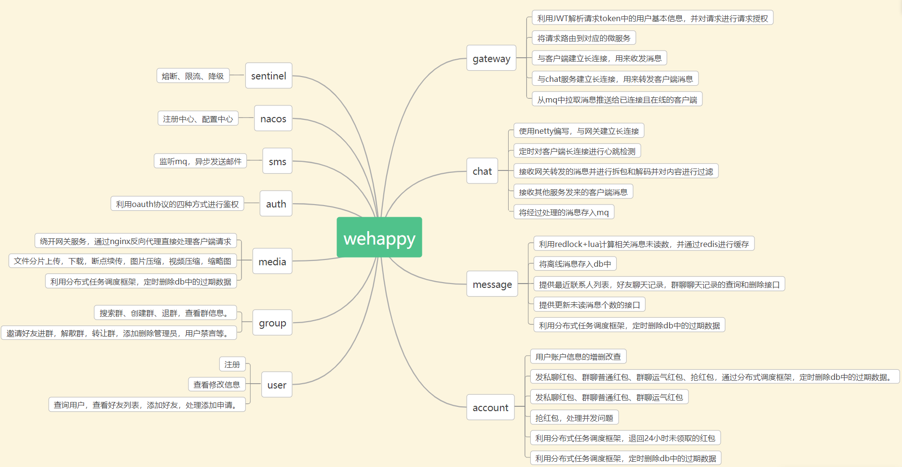
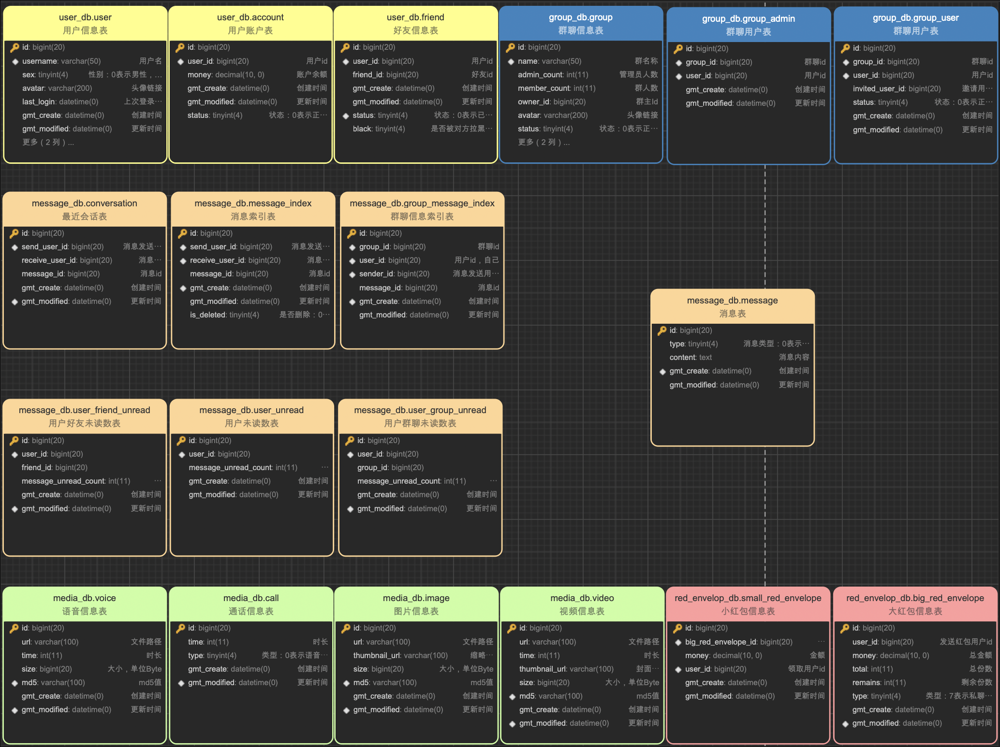

## `wehappy` 是一个利用 `Spring Cloud` 微服务框架搭建的即时通信系统

### TodoList

 - [ ] `user` 点赞
 - [ ] `chat` 服务把用户和群组整合进聊天
 - [ ] `gateway` 用户上线时向 `mq` 写入用户上线消息
 - [ ] `message` 从 `mq` 拉取推送消息，落入 `db`
 - [ ] `message` 计算未读消息数、更新未读消息数
 - [ ] `message` 提供用户最近联系人列表、私聊聊天记录、群聊聊天记录查询删除接口
 - [ ] `message` 定时删除 `db` 中的过期聊天记录
 - [ ] `account` 用户账户信息增删改查
 - [ ] `account` 发私聊红包、群聊普通红包、群聊运气红包
 - [ ] `account` 抢红包接口
 - [ ] `account` 定时退回未领取的红包
 

### 环境搭建

#### `linux & mac`

1. 安装 `jdk11`, 不兼容 `jdk8`
2. 安装 `docker` 和 `docker-compose`
3. 运行 `start_db.sh` 启动 `mysql`
4. 连接 `mysql`
5. 执行 `config/sql` 下的两个数据库脚本
6. 进入 `config` 目录
7. 执行 `start_env.sh` 启动项目运行环境

### 启动服务

1. `auth`: `AuthApplication`, 鉴权服务
2. `user`: `UserApplication`, 用户服务
3. `sms`: `SmsApplication`, 邮件服务
4. `group`: `GroupApplication`, 群组服务
5. `chat`: `ChatApplicati**on`, 聊天服务
6. `media`: `MediaApplication`, 媒体服务
7. `message`: `MessageApplication`, 消息服务
8. `account`: `AccountApplication`, 账户服务

### 访问swagger文档

1. `url`: `localhost:9901/doc.html`

#### 架构设计

#### 详细功能：

#### 数据库设计：

