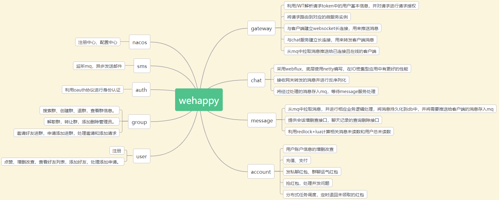

### 项目简介

`wehappy` 是一个利用 `Spring Cloud` 微服务框架搭建的即时通信系统。主要功能包含：
1. 账号注册、登录。
2. 好友搜索、添加。
3. 群组创建、搜索、添加、解散、转让、管理员增删、成员管理等。
4. 聊天，`websocket` 长连接聊天、`protobuf` 消息序列化、消息推送、会话消息未读数和总消息未读数统计
5. 红包，发红包、抢红包、定期退回等。

### 环境搭建

#### `linux & mac`

1. 安装 `jdk11`, 不兼容 `jdk8`
2. 安装 `docker` 和 `docker-compose`
3. 运行 `start_db.sh` 启动 `mysql`
4. 连接 `mysql`
5. 执行 `config/sql` 下的两个数据库脚本
6. 进入 `config` 目录
7. 执行 `start_env.sh` 启动项目运行环境

### 启动服务

1. `auth`: `AuthApplication`, 鉴权服务
2. `user`: `UserApplication`, 用户服务
3. `sms`: `SmsApplication`, 邮件服务
4. `group`: `GroupApplication`, 群组服务
5. `chat`: `ChatApplication`, 聊天服务
6. `media`: `MediaApplication`, 媒体服务
7. `message`: `MessageApplication`, 消息服务
8. `account`: `AccountApplication`, 账户服务

### 访问 `swagger` 文档

1. `url`: `localhost:9901/doc.html`
2. 聊天页面: `portal/index.html`

#### 架构设计

#### 详细功能：

#### 数据库设计：

